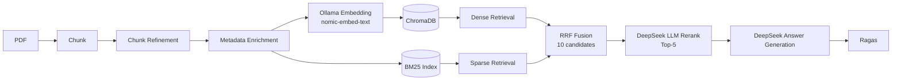
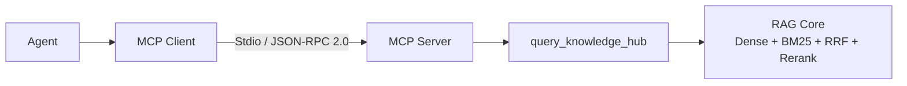

# Modular RAG MCP Server — Engineering Extensions

一个基于真实文档完成端到端验证的模块化 RAG + MCP 工程项目。当前版本聚焦混合检索、LLM 重排、真实答案生成、Ragas 评估、MCP Stdio 兼容与链路可观测性。

> [!IMPORTANT]
> **Upstream attribution:** 本项目基于 [jerry-ai-dev/MODULAR-RAG-MCP-SERVER](https://github.com/jerry-ai-dev/MODULAR-RAG-MCP-SERVER) 进行二次工程化扩展。上游项目提供了模块化 RAG / MCP 的原始架构与基础实现；下文 **My Engineering Extensions** 仅描述我在本仓库中新增、适配并实际验证的工作，不将上游成果声明为个人原创。上游版权与许可信息以原仓库为准。

独立的设备售后服务运营扩展（M0–M5）集中在 [service_operations/](service_operations/README.md)，其合成业务样本与原 RAG 技术基线分开说明。

## Project Snapshot

| Area | Verified Result |
| --- | --- |
| Runtime | WSL Ubuntu / Python 3.12 / DeepSeek / Ollama / ChromaDB / BM25 |
| RAG | Dense + Sparse hybrid retrieval → RRF → DeepSeek LLM rerank，10 candidates → Top-5 |
| Evaluation | 2 PDFs / 56 chunks / 10-query regression set / 10 of 10 queries completed |
| MCP | MCP Python SDK 2.2 compatibility（validated on 2.2.0）/ Stdio E2E 7 of 7 passed |
| Observability | Ingestion Trace / Query Trace / Evaluation Dashboard |

## My Engineering Extensions

### Runtime

- 在 **WSL Ubuntu / Python 3.12** 环境完成运行与验证。
- 使用 **DeepSeek `deepseek-chat`** 执行 LLM rerank、answer generation，并接入 Ragas 的 LLM 评估链路。
- 使用 **Ollama `nomic-embed-text`** 生成 dense embeddings，并适配 Ragas embedding 接口。
- 使用 **ChromaDB** 保存向量索引，使用 **BM25** 保存与查询稀疏索引。

### RAG Pipeline

- 跑通 **PDF Ingestion**，完成文档解析、分块和索引写入。
- 接入 **Chunk Refinement / Metadata Enrichment**，将优化后的 chunk 与结构化 metadata 送入后续索引流程。
- 并行执行 **Dense Retrieval** 与 **BM25 Sparse Retrieval**。
- 使用 **Reciprocal Rank Fusion（RRF）** 融合两路排序结果。
- 将融合后的 **10 candidates** 交给 **DeepSeek LLM Rerank**，输出 **Top-5** 上下文。
- 基于 Top-5 上下文执行真实 **Answer Generation**，供评估链路使用。

### Evaluation

- 使用 **2 份领域 PDF**，摄取后形成 **56 chunks**。
- 人工设计 **10 条 Golden Queries**，组成可重复运行的 regression set。
- 让 **Evaluation Pipeline 与真实 Query Pipeline 对齐**：复用相同的 Dense + BM25 + RRF + LLM rerank 路径与配置。
- 在 shared / batch Evaluation Pipeline 中使用 **DeepSeek** 完成真实 Answer Generation；Ragas 不再评估检索 chunk 的拼接文本。
- 完成 **Ragas 对 DeepSeek + Ollama 的适配**。
- 修复 shared / batch Evaluation Pipeline 原有以 chunk 拼接结果作为 `generated_answer` 的占位逻辑，要求评估输入必须是模型生成的非空答案。
- **10/10 evaluation queries successful**，全部完成检索、重排、答案生成与 Ragas 评分。

### MCP

- 完成 **MCP Python SDK 2.2 compatibility** 适配，并在 SDK 2.2.0 上完成验证；同时保留对旧版 handler 注册方式的兼容分支。
- 修复 **Python 3.12 / WSL Stdio compatibility** 问题，使用可靠的异步原始 Stdio 读写路径。
- 实现 **stdout / stderr JSON-RPC isolation**：stdout 仅承载协议消息，日志与诊断信息写入 stderr，避免污染 MCP wire protocol。
- **MCP E2E 7/7 passed**。
- 已通过外部 Stdio Client 对真实、非空 collection 调用 `query_knowledge_hub`，验证 MCP Tool 到 RAG Core 的端到端链路。

### Observability

- **Ingestion Trace**：记录 PDF 摄取、分块、转换、embedding 与存储阶段。
- **Query Trace**：记录 dense retrieval、sparse retrieval、RRF fusion 与 rerank 阶段。
- **Evaluation Dashboard**：展示评估运行、聚合指标与单 query 结果，便于回归对比和问题定位。

## Architecture

### RAG and Evaluation Flow



BM25 直接基于 enriched chunks 建立稀疏索引，不消费 embedding；因此存储与检索阶段按 ChromaDB / BM25 两条支路并行，再在 RRF 汇合。

### MCP Call Flow



Agent 与 MCP Client 是外部调用方；本仓库交付并验证的是 **MCP Server + `query_knowledge_hub` + RAG Core** 链路。

## Evaluation Baseline

### Setup

| Item | Value |
| --- | --- |
| Source documents | 2 domain PDFs |
| Indexed data | 56 chunks |
| Regression set | 10 manually designed Golden Queries |
| Retrieval path | Dense + BM25 → RRF → DeepSeek LLM Rerank |
| Candidate reduction | 10 candidates → Top-5 |
| Answer generation | DeepSeek `deepseek-chat` |
| Successful queries | 10/10 |

### Recorded Ragas Results

| Metric | Score |
| --- | ---: |
| Faithfulness | 0.9950 |
| Answer Relevancy | 0.9362 |
| Context Precision | 0.8344 |

> **结果边界：** 这些结果基于 2 份领域文档、56 个 chunks 和人工构造的 10-query regression set，属于 **project-level baseline**，不是 **production-scale benchmark**，也不得称为 **accuracy**。这些分数不代表吞吐、并发或线上性能结论；由于包含 LLM judge，不同运行批次可能存在轻微波动。

## Implementation Map

| Concern | Main Location |
| --- | --- |
| PDF ingestion and indexing | [`src/ingestion/`](src/ingestion/) |
| Hybrid retrieval and rerank | [`src/core/query_engine/`](src/core/query_engine/) |
| Shared evaluation pipeline | [`src/observability/evaluation/pipeline.py`](src/observability/evaluation/pipeline.py) |
| Evaluation runner | [`src/observability/evaluation/eval_runner.py`](src/observability/evaluation/eval_runner.py) |
| DeepSeek + Ollama Ragas adapter | [`src/observability/evaluation/ragas_evaluator.py`](src/observability/evaluation/ragas_evaluator.py) |
| MCP Stdio server | [`src/mcp_server/server.py`](src/mcp_server/server.py) |
| MCP query tool | [`src/mcp_server/tools/query_knowledge_hub.py`](src/mcp_server/tools/query_knowledge_hub.py) |
| Evaluation Dashboard | [`src/observability/dashboard/pages/evaluation_panel.py`](src/observability/dashboard/pages/evaluation_panel.py) |

## Run Locally

### Validated Environment

- WSL Ubuntu / Python 3.12
- Ollama with `nomic-embed-text`
- DeepSeek credentials supplied through the local runtime environment

Install the project dependencies and prepare the embedding model:

```bash
python3.12 -m venv .venv
source .venv/bin/activate
python -m pip install -e ".[dev]"
ollama pull nomic-embed-text
```

Review [`config/settings.yaml`](config/settings.yaml), keep credentials outside tracked configuration, and then run the required path:

```bash
# Ingest PDFs
mkdir -p ./documents
# Add PDF files to ./documents before ingestion.
python scripts/ingest.py --path ./documents --collection demo

# Exercise the query CLI
python scripts/query.py --query "your question" --collection demo --top-k 5

# Run the example golden-set workflow; this is not the reported 10-query baseline.
python scripts/evaluate.py --test-set ./tests/fixtures/golden_test_set.json \
  --collection demo \
  --top-k 5

# Start the MCP Stdio server
python -m src.mcp_server.server

# Start the observability dashboard
python scripts/start_dashboard.py
```

The reported baseline requires the same two source PDFs, the same 10-query regression set, and the same provider configuration; the generic commands above demonstrate the workflow but do not imply reproduction of those scores with different data.

## Verification

无需外部服务的评估单测与 MCP Stdio smoke tests：

```bash
pytest -q tests/unit/test_evaluation_pipeline.py \
  tests/unit/test_eval_runner.py \
  tests/unit/test_evaluation_panel.py

pytest -q \
  tests/integration/test_mcp_server.py::test_mcp_server_initialize_stdio \
  tests/integration/test_mcp_server.py::test_mcp_server_tools_list_stdio
```

运行 7 项 wire-level MCP Client E2E：

```bash
pytest -q tests/e2e/test_mcp_client.py
```

此外，已在配置 DeepSeek / Ollama 的 **56-chunk 非空 collection** 上，使用外部 Stdio Client 完成独立 black-box Tool 调用；该验收不是 empty-store 或 handler-only mock。

## Scope and Limitations

- 当前结果验证的是小规模、项目级 RAG regression baseline，不外推到生产数据规模。
- 当前未提供 QPS、并发、延迟或性能提升百分比结论。
- **Vision / Image Captioning 不属于本次已完成并验证的工程扩展范围，不宣称 Vision 已完成。**
- Agent 与 MCP Client 不属于本仓库交付范围；它们仅用于说明 MCP Server 的调用边界。
- 任何公开简历描述都应限定在本节与 **My Engineering Extensions** 中列出的真实验证范围内。

## Upstream

- Original project: [jerry-ai-dev/MODULAR-RAG-MCP-SERVER](https://github.com/jerry-ai-dev/MODULAR-RAG-MCP-SERVER)
- This repository is a derived engineering extension; upstream authorship and contribution history must remain credited.
