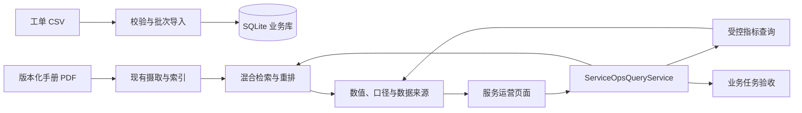

# 设备售后服务运营助手：开发规格

> 状态：M0–M5 技术构造已完成；M5 文档证据待独立人工复核；供 `feat/service-operations` 分支逐项实现与修订  
> 版本：0.1  
> 日期：2026-09-28  
> 适用范围：数据分析与企业数字化岗位作品，不代表真实企业生产系统

## 1. 项目目标

把现有模块化 RAG 项目扩展成一个能完成**设备售后服务运营分析**的可演示应用。服务经理能用结构化工单数据查看故障和服务指标；现场工程师能查找适用版本的设备手册；遇到混合问题时，系统把可复算的指标与可核对的文档依据放在同一结果中。

本项目要证明四种能力：

1. 将业务问题转成明确的数据口径和查询任务。
2. 摄取、校验、建模和分析结构化数据。
3. 管理非结构化文档的版本、来源和检索证据。
4. 用业务界面、质量报告和验收任务交付可复现的结果。

**成功标准是任务完成质量，不是 PDF、chunk、工单或问题的数量。** 现有“2 份 PDF／56 个 chunk／10 个问题”只记录旧版技术链路验收，不作为本扩展的效果基线或简历成果。

## 2. 与现有仓库的关系

| 现有能力 | 当前入口 | 本扩展的使用方式 |
| --- | --- | --- |
| PDF 摄取、分块、ChromaDB、BM25 | `src/ingestion/pipeline.py` | 复用检索底座，增加手册业务身份与版本选择 |
| Dense＋Sparse＋RRF＋重排 | `src/core/query_engine/` | 用于手册问题；检索结果必须受产品型号和生效时间约束 |
| 引用构建与 MCP Stdio 工具 | `src/core/response/`、`src/mcp_server/` | 复用引用数据结构；服务运营应用先通过独立服务层调用 |
| 评估器、评估面板 | `src/observability/evaluation/`、`src/observability/dashboard/` | 复用文档检索评估；新增 SQL 指标和混合任务验收 |
| 摄取与查询 Trace | `src/core/trace/` | 保留阶段耗时与错误信息，去除不必要的原文记录 |

当前仓库**没有**业务工单数据库、业务指标口径、手册逻辑版本、服务运营页面或面向此场景的联合回答服务。MCP `query_knowledge_hub` 当前主要返回检索片段与引用；评估链路中的答案生成不能直接视为已交付的业务问答入口。

本规格位于独立的 `service_operations/` 功能包，独立于根目录的 `DEV_SPEC.md`。后者描述原项目总体设计，本文件只描述服务运营扩展。每个阶段完成后更新本文件的状态与验收记录；计划项不能写成已实现能力。

## 3. 业务边界与使用者

### 3.1 使用者

| 使用者 | 主要任务 | 需要看到的证据 |
| --- | --- | --- |
| 服务经理 | 比较故障、修复时长和 SLA 趋势，定位异常型号或站点 | 指标定义、时间范围、样本量、工单明细 |
| 现场工程师 | 根据设备型号、故障码查当前适用处理步骤 | 手册名称、版本、生效日期、页码或段落 |
| 数据维护者 | 导入新工单与手册，定位脏数据和索引失败 | 批次、源文件、质量问题、处理状态 |

### 3.2 必须支持的三类问题

1. **文档问题**：例如“TAZ Pro 的 PROBE FAIL CLEAN NOZZLE 应如何检查？”
2. **指标问题**：例如“上一季度 TAZ Pro 的平均修复时长是多少？比前一季度变化多少？”
3. **混合问题**：例如“近三个月 TAZ Pro 的 NOZZLE_WIPE 重复故障率是否上升？应按哪个版本的材料记录流程处理？”

用户提出超出已有指标定义、没有合格数据或没有适用手册的问题时，系统应说明缺口，不生成貌似准确的数字或处理步骤。

### 3.3 演示数据的真实性标注

- 手册：使用来源清楚、允许用于演示的公开材料，或自行编写并标注为模拟手册。记录来源 URL、获取日期、许可或使用说明。
- 工单：若没有获准使用的真实数据，使用明确标注的**合成数据**。生成规则、随机种子和注入的异常模式必须保存，可重复生成。
- 任何计时实验或用户测试均标注测试条件。不得把合成数据、实验室任务或模型评估表述为真实企业营收、效率或线上准确率。
- 演示集建议覆盖多个型号、站点、月份、故障码与手册版本，并包含故意设计的边界情况；具体记录数只作为测试覆盖手段。

## 4. 目标架构



业务指标由 SQL 和 Python 确定性逻辑计算。RAG 负责找手册依据及生成有边界的文字解释。模型不得编造指标值，也不得直接执行它生成的任意 SQL。现有 Streamlit 面板可承载业务页面；底层查询逻辑必须独立于页面，便于 CLI、测试或未来 API 复用。

## 5. 数据契约

### 5.1 业务数据模型

首版使用独立的 `service_operations/runtime/service_operations.db`，不复用摄取历史库作为业务库。数据库至少包含：

| 表 | 关键字段 | 约束与用途 |
| --- | --- | --- |
| `ingestion_batches` | `batch_id`、`source_hash`、`imported_at`、`status`、`row_counts`、`schema_version` | 一次导入的来源和结果；成功的 `batch_id` 同时充当 `snapshot_id` |
| `active_snapshot` | 固定主键、`snapshot_id`、`activated_at` | 指向当前可查询的完整快照；与快照数据在同一事务中切换 |
| `assets` | `snapshot_id`、`asset_id`、`model`、`site` | 设备维表；`(snapshot_id, asset_id)` 唯一 |
| `work_orders` | `snapshot_id`、`work_order_id`、`asset_id`、`fault_code`、`priority`、`opened_at`、`resolved_at`、`status` | 工单事实表；关联设备，同一快照内工单 ID 唯一 |
| `sla_policies` | `snapshot_id`、`policy_id`、`priority`、`effective_from`、`effective_to`、`resolution_hours` | 计算到期时间；生效区间不能在同一优先级上重叠 |
| `data_quality_issues` | `batch_id`、`source_file`、`row_number`、`rule_id`、`severity`、`message` | 保存拒收或警告原因，不静默丢弃记录 |

`snapshot_id` 表示同一批次、同一口径的数据视图，值等于该批次 `batch_id`。首版采用**完整快照导入**：所有文件校验通过后，在单个 SQLite 事务中写入并切换 `active_snapshot`；失败时旧快照仍可查询。相同输入哈希重复导入应为无操作。增量 CDC、跨系统同步和分布式事务留待后续需求明确时设计。

输入契约另存为版本化 schema 文档。最低要求：必填字段、枚举、外键、时间戳格式、唯一键、允许空值、单位和异常处理规则。所有时间戳输入必须带时区，库中统一存 UTC；业务筛选区间按 `Asia/Shanghai` 转换。展示时间和指标口径须明确时区。

### 5.2 数据质量规则

至少检查：重复工单 ID、未知设备、非法状态／优先级、时间戳解析失败、`resolved_at < opened_at`、已解决状态缺少解决时间、SLA 策略缺失或重叠。严重错误拒收整个快照；可接受的业务异常可作为警告保留，但不能悄悄改变指标分母。导入后输出批次报告：总行数、有效行数、拒收行数、规则分布及源文件哈希。

### 5.3 手册注册与版本

为手册建立独立注册信息：`logical_doc_id`、`model`、`fault_code`（可选）、`version`、`effective_from`、`effective_to`、`source_path`、`source_hash`、`publication_status`。`logical_doc_id` 表示“同一份业务手册”，`source_hash` 表示物理内容版本；两者不能混用。只有已发布且在查询时间有效的版本能用于当前处理建议；历史问题允许显式选择过去日期。

需要先修复现有去重语义：`src/libs/loader/file_integrity.py` 的 `ingestion_history` 以 `file_hash` 为全局主键，`should_skip()` 仅按哈希查询，同一文件进入不同 collection 可能被错误跳过。版本化手册必须使用能区分 collection／业务文档／物理版本的身份，并定义替换与删除时 ChromaDB、BM25、注册表的协调顺序。

检索中产品型号和有效版本是**约束条件**。当前 `HybridSearch` 存在融合后再按 metadata 过滤的路径；实现时要保证筛选发生在最终 Top-K 截断前，且 Dense 与 BM25 两路都不会泄露不适用版本。用“旧版相关性更高”的测试样例验证此性质。

## 6. 指标口径

所有指标函数都接收 `snapshot_id`、半开时间区间 `[start, end)`、可选 `model/site/priority/fault_code` 筛选和 `as_of`。返回值包含分子、分母或样本量、单位、口径版本、筛选条件与数据快照。分母为零时返回 `null` 和原因，不返回 0%。

| 指标 | 首版定义 | 时间归属 |
| --- | --- | --- |
| 平均修复时长（MTTR） | 符合条件的已解决工单，`resolved_at - opened_at` 的算术平均，单位小时；未解决工单不进样本 | `resolved_at` 落在区间内 |
| SLA 达成率 | 到期时间不晚于 `as_of` 且到期时间落在区间内的工单中，`resolved_at <= due_at` 的占比；到期仍未解决计为未达成 | `due_at` 落在区间内 |
| 30 天重复故障率 | 区间内新开工单中，同一设备与故障码曾在前 30×24 小时内有已解决工单的占比；它表示“重复事件”，不等于“同一工单重开” | 新工单 `opened_at` 落在区间内 |

`due_at` 根据工单创建时有效的 SLA 策略及自然小时计算；首版不处理工作日、节假日或暂停计时。若后续接入真实业务，须先由业务方确认口径。环比采用相邻、等长的时间区间；同时展示两个区间的分子／分母和变化值，避免只展示百分比。

指标查询必须使用参数化 SQL 或预定义查询函数，不把自然语言直接拼接进 SQL。保留至少三个可独立运行的 SQL 示例，展示 JOIN、分组、时间过滤及窗口／CTE 的实际应用。

## 7. 联合查询与输出契约

### 7.1 查询路由

`ServiceOpsQueryService` 接收结构化输入：`question`、`mode`（`document | metric | combined | auto`）、`model`、`site`、`period`、`as_of`、`snapshot_id`。`auto` 只将自然语言映射到**已定义的意图和参数**；解析不确定时返回可选条件或请用户补充，不能自行发明新指标。

文档查询复用现有检索服务。指标查询调用指标注册表。混合查询分别执行两路，并在合成回答前验证型号、时间与手册版本是否一致。SQL 失败不能降级成模型估算；检索无合格依据不能降级成无来源的操作建议。

### 7.2 最小输出形状

```json
{
  "mode": "combined",
  "answer": "...",
  "metrics": [{
    "metric_id": "repeat_fault_rate_30d",
    "value": null,
    "unit": "ratio",
    "numerator": 0,
    "denominator": 0,
    "period": {"start": "...", "end": "..."},
    "filters": {"model": "A"},
    "snapshot_id": "...",
    "definition_version": "v1"
  }],
  "citations": [{
    "logical_doc_id": "...",
    "version": "...",
    "source": "...",
    "page_or_section": "...",
    "effective_from": "..."
  }],
  "data_as_of": "...",
  "warnings": ["NO_ELIGIBLE_WORK_ORDERS"]
}
```

上例展示了分母为零时的字段形状；实际响应允许只有 metrics 或 citations，但 `combined` 模式若缺任一路必须在 `warnings` 中说明。页面应展示可复算条件和来源，并允许进入相应工单明细或手册位置。

## 8. 页面与用户流程

在现有 Streamlit 管理面板中增加 `Service Operations` 页面，底层使用独立服务层。页面至少包含：

1. 数据状态：活动快照、刷新时间、各表行数、质量问题数量。
2. 指标总览：三项指标、环比、按型号／站点／故障码筛选及分组趋势。
3. 明细追溯：图表选中范围后可查看构成指标的工单和所用口径。
4. 联合提问：显示自然语言回答、SQL 指标证据、手册引用与警告。
5. 数据维护入口：导入结果、拒收原因、手册版本与索引状态；具有破坏性的管理操作不放在普通业务页面。

最短演示路径：导入一批工单与两版手册 → 查看某型号的异常趋势 → 展开相关工单 → 提问处理方法 → 核对回答使用的是当前生效手册 → 导入含异常值的新批次并查看质量报告。

## 9. 评估与验收

### 9.1 验收数据

建立独立于旧 10-query 集合的服务运营任务集。初始目标约 100 个经过人工核查的案例，覆盖指标、文档、混合、过期版本、缺数据及拒答；留出至少 20% 作为开发时不参与调参的保留集。数量是覆盖规划，不是简历绩效。每个案例记录问题、筛选条件、期望 SQL 值／来源、允许的数值误差和失败类型。

### 9.2 质量指标

| 维度 | 检验方法 | 首版完成门槛 |
| --- | --- | --- |
| 数据导入正确性 | 固定 CSV 批次重复导入、异常注入、事务回滚 | 重复导入不改活动快照；严重错误不产生半成品快照 |
| 指标正确性 | 预定义 SQL 与独立基准计算逐例比较 | 保留集内定义明确的指标题全部在规定误差内一致 |
| 版本正确性 | 故意设置“旧版文本更相似”的案例 | 当前时间查询不得引用失效手册 |
| 文档证据 | 人工核查来源、版本、定位信息 | 报告正确率和失败清单；上线作品前修复高风险错引 |
| 混合回答 | 逐项核对数值、口径、引用和结论 | 不出现模型编造的数值；任一路失败有明确警告 |
| 可复现性 | 新环境按 README 导入样本并完成演示路径 | 无需手改数据库或测试文件 |

把离线评估结果按检索配置和数据快照保存，至少比较一个简单基线与当前混合检索。评估报告包含案例分布、各类错误、运行环境和模型配置；不把 Ragas 分数称为“业务准确率”。可记录本地响应延迟，但需注明硬件和服务环境，不外推 QPS 或生产并发。

### 9.3 测试层次

- 单元：时间区间、指标分母、重复故障边界、SLA 生效、参数校验和空数据。
- 集成：CSV→SQLite 快照、手册注册→双索引→版本检索、失败回滚。
- 端到端：导入→看板→联合提问→证据核对；模型调用用可控替身覆盖确定性逻辑，少量真实模型调用用于演示验收。
- 回归：旧项目的摄取、混合检索、MCP Stdio 和评估入口仍可按原命令工作。

## 10. 安全、日志与运行边界

- 首版为本地演示应用，默认只绑定本机；不宣称已有企业级多租户、RBAC 或生产合规。
- 演示数据不能包含未经授权的客户、员工或设备敏感信息。密钥继续从环境变量读取。
- 业务查询对 SQLite 使用只读连接和参数化查询。自然语言不能触发写入或任意 SQL。
- Trace 只保留阶段、耗时、记录 ID、计数和错误类别。现有摄取 Trace 在 `src/ingestion/pipeline.py` 的 `load` 阶段保存 `document.text`，实施前须调整，避免将整份手册写进日志。
- 提供数据库快照备份／恢复说明；导入失败不改变当前活动快照。
- 用户界面应显示“合成工单数据”和“本地演示”的标识，避免被误认为真实上线案例。

## 11. 拟新增模块与修改点

以下路径是建议的代码边界，首次实现时可在不改变职责的前提下调整名称。

| 位置 | 职责 |
| --- | --- |
| `service_operations/contracts.py` | 输入、指标、来源、响应的数据契约 |
| `service_operations/warehouse/` | CSV schema、批次校验、SQLite 仓储、质量报告 |
| `service_operations/metrics/` | 三项版本化指标及安全查询注册表 |
| `service_operations/manuals/` | 手册业务注册、版本选择和索引协调 |
| `service_operations/query_service.py` | 文档、指标、混合任务的编排与证据合成 |
| `service_operations/dashboard.py` | 业务页面；复用服务层，不直接写 SQL／检索逻辑 |
| `service_operations/cli.py` | 可重复执行的数据与手册导入入口 |
| `service_operations/evaluate.py` | 服务运营任务集评估与报告生成 |
| `service_operations/tests/` | 单元、集成、端到端及保留集 fixture |

需要修改的现有模块主要是文件去重／删除身份、手册 metadata 传递、检索版本约束、Trace 原文记录和 Dashboard 页面注册。功能包内的 `README.md` 说明本扩展；根目录 README 只保留入口链接。

## 12. 分阶段实施与交付门槛

| 阶段 | 主要工作 | 可审查交付物 | 进入下一阶段的条件 |
| --- | --- | --- | --- |
| M0：业务与样本 | 冻结任务、指标口径、数据 schema、手册来源和合成数据标识 | 业务说明、指标字典、样本 manifest | 三类问题均有样例与期望证据 |
| M1：结构化数据 | 快照导入、质量规则、三项 SQL 指标 | 导入 CLI、SQLite schema、质量报告、指标测试 | 异常批次可回滚，指标与基准计算一致 |
| M2：手册版本 | 逻辑文档身份、跨集合去重修复、版本选择及双索引协调 | 注册表、版本查询、旧版更相似的回归案例 | 当前查询不返回失效版本，旧版删除不破坏新版 |
| M3：联合查询 | 查询契约、任务路由、受控指标查询、来源合成 | 服务层、结构化响应、混合问题测试 | 数值可复算、文档可定位、失败有明确警告 |
| M4：业务页面 | 指标趋势、明细追溯、联合提问、数据质量状态 | 演示页面与演示脚本 | 非开发者可按最短路径完成任务 |
| M5：验收与作品 | 任务集、保留集、回归、运行说明、案例材料 | 评估报告、README、架构图、中英文一页案例 | 新环境能复现；公开表述与证据一致 |

M0 产物见 [`docs/M0_FOUNDATION.md`](docs/M0_FOUNDATION.md)、[`docs/manual_sources.json`](docs/manual_sources.json)、[`config/m0.json`](config/m0.json) 与 [`examples/m0/sample_manifest.json`](examples/m0/sample_manifest.json)。样本可用 `python -m service_operations.generate_m0` 重建；M0 的完成仅指规格和样本基线已就绪，不代表导入、指标服务或手册检索已经实现。

M1 产物与复现命令见 [`docs/M1_IMPLEMENTATION.md`](docs/M1_IMPLEMENTATION.md)。M1 阶段实现了完整快照导入、质量报告、三项受控 SQL 指标和独立 SQL 示例；手册版本与联合查询分别在 M2、M3 实现。

M2 产物与复现命令见 [`docs/M2_IMPLEMENTATION.md`](docs/M2_IMPLEMENTATION.md)。已实现手册注册、按业务时间选版本、页码引用、Chroma/BM25 双索引协调及跨 collection 去重修复；当前本地 Dense 适配器为词项哈希基线，不宣称语义检索效果。M3 产物与复现命令见 [`docs/M3_IMPLEMENTATION.md`](docs/M3_IMPLEMENTATION.md)。已实现结构化请求、受控路由、等长前期比较、指标与手册证据合成及缺证据警告；回答目前是确定性引用模板，尚未接入生成式模型。M4 页面、只读数据服务和演示脚本见 [`docs/M4_IMPLEMENTATION.md`](docs/M4_IMPLEMENTATION.md) 与 [`examples/m4/demo_script.md`](examples/m4/demo_script.md)；已具备快照状态、三项指标、分组趋势、工单追溯、联合提问和质量／手册状态展示。每个阶段先完成可运行的最小闭环，再扩充样本与页面细节。实施时通过小提交记录设计选择与失败案例，方便后续面试复盘。

## 13. 首版完成定义

满足下列条件，才可把本扩展称为“设备售后服务运营助手”：

1. 导入一批含质量异常的工单后，能够看到拒收／警告及可用快照；失败导入不会污染旧结果。
2. 三项指标能按时间、型号和站点查询，显示口径、样本量、快照及可追溯明细。
3. 同一手册有多个版本时，当前问题只使用当前有效版本；历史查询能明确指定历史时间。
4. 文档、指标和混合问题都能在页面完成；每个数字可复算，每条操作建议可核对来源。
5. 独立任务集和测试报告覆盖正确、失败和边界案例；README 能让另一位开发者复现演示。
6. 简历及演示明确区分原项目能力、本扩展贡献、合成数据和未验证的生产能力。

## 14. 暂缓项与后续决策

首版聚焦数据与数字化岗位证据。Redis、Kubernetes、多 Agent、任意自然语言 SQL、实时流数据、企业 SSO／RBAC、复杂工作日 SLA 和更多向量库均不作为首版验收条件。若具体目标岗位明确要求，再根据实际收益单独立项。

M0 已选定 TAZ Pro 与 TAZ Workhorse 官方手册及项目自编的版本化便签，并记录合成工单的业务规则。若后来获得可公开使用的真实数据，应重新核查许可、隐私、指标口径和任务集，不直接替换文件后沿用旧评估结论。


## M5 验收记录（2026-09-28）

M5 的固定任务、独立 CSV 参考值、开发集与保留集、BM25 对照和逐例 JSON 评估器见 `examples/m5/tasks.jsonl`、`evaluation/`、`evaluate.py`。本地 80/80 开发集与 20/20 保留集自动检查通过；原始检索 Hit@3 为 16/20（融合与 BM25 相同），业务响应的引用核对为 20/20。详细限制、初次失败与修复见 `docs/M5_EVALUATION.md`。架构图、中文与英文一页案例在 `docs/`。这些任务还没有第二人逐条核查，故不可宣称“100 例人工验证”；对外作品演示前须人工复核文档证据与处理语义。
