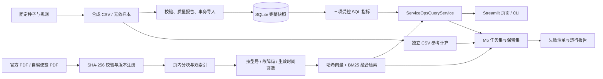

# 服务运营扩展架构与数据流

- `service_operations/` 集中维护业务代码、任务集和文档；原 Dashboard 只注册页面入口。数据库和索引放在忽略版本控制的 `runtime/`。
- 指标由参数化 SQL 返回数值、分子分母、工单 ID、口径版本和快照；自然语言不能执行任意 SQL。CSV 参考计算不调用这些 SQL 函数。
- 官方 PDF 是厂商维修来源；两版服务记录便签是项目自编演示材料。版本选择先于两路检索，回答保留来源哈希与物理 PDF 页码。
- 当前向量路是 384 维确定性词项哈希，本地无需模型服务；回答由确定性模板组成。这里的“融合检索”不能表述为深度语义模型或生成式 AI 已上线。
- 20 例保留集与 80 例开发集固定在同一任务文件。自动测试结果与人工来源核查状态分别记录。
